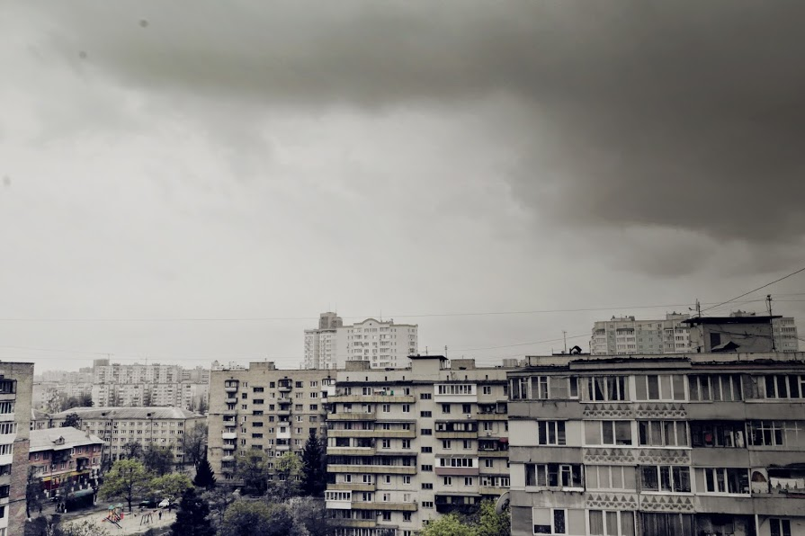
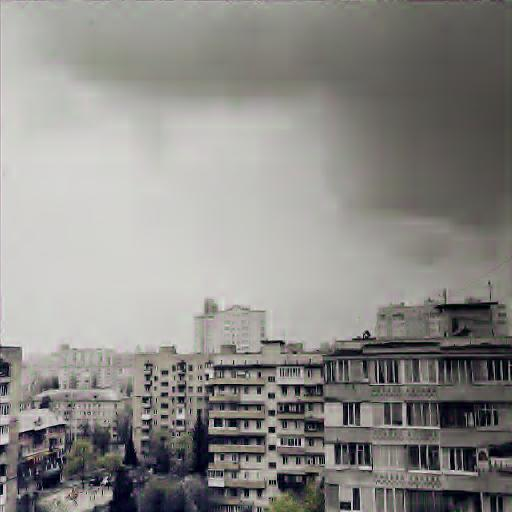

# wavelet_transform
This utility writed with python 3, can compress images in grayscale and RGB modes by using transformation of Haar(D2) or Daubechies(D4) wavelets. 
Compression which provided by quantization for RGB images can be done separately for each channel.

#####Libraries required
1. Python Imaging Library (PIL)
2. NumPy

#####Usage
    python3 wvlt.py -[v]c <inputfile> -s <outputfile> [F, RGB] [D2, D4] [threshold_1, threshold_3, threshold_2]
    
* COLOR_MODE: [F, RGB]
* MODE(transformation): [D2, D4]
* THRESHOLD: [0..1]

Input image (167,7 kB) | Output image (30,2 kB)
------------ | -------------
 | 

#####Code for example above
    python3 wvlt.py -c res/6.jpg -s out/6_D4_01_03_01.jpg RGB D4 0.1 0.3 0.1
